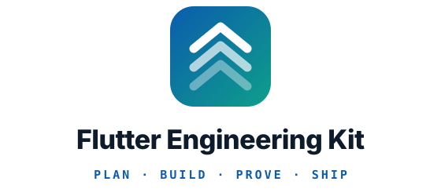

<p align="center">
  <picture>
    <source media="(prefers-color-scheme: dark)" srcset="assets/logo-dark.svg">
    
  </picture>
</p>

<p align="center"><em>Build Flutter apps with AI agents the way a good team would: settle the requirement, build it
test-first, prove it works, and ship it, from one ticket to a whole project.</em></p>

<p align="center">
  <a href=".claude-plugin/plugin.json"></a>
  <a href="LICENSE"></a>
  
  <a href="https://github.com/kratagyaagarwaldots/flutter-engineering-kit/actions/workflows/pages.yml"></a>
  
</p>

**Website:** https://kratagyaagarwaldots.github.io/flutter-engineering-kit/

**Docs:** [Install](#install) · [Commands](#commands) · [Project delivery](#project-delivery) ·
[Agent loop](#the-agent-loop) · [Agents](agents/README.md) · [Changelog](CHANGELOG.md)

**Let your agent install it:** point it at [INSTALL.md](INSTALL.md).

---

Skills and agents for **engineering** Flutter apps rather than vibe-coding them: understand the
code, design the change, build it test-first, prove it works, and ship it. Run as a project, the
same kit writes the proposal, cuts the backlog, plans the sprints, gates each build and sorts the
feedback, keeping the project's memory in the repo and its tickets in GitHub.

Every skill is small, readable, and adapts to the stack the project already uses. Nothing here owns
your process; you compose the parts you want.

Built from what worked across a run of real apps, and from three public skill sets
([pstack](https://github.com/cursor/plugins/tree/main/pstack),
[mattpocock/skills](https://github.com/mattpocock/skills) and
[emilkowalski/skills](https://github.com/emilkowalski/skills)).

## Install

The kit installs **once for your user**, not into each project, and works with Claude Code, Codex,
opencode, Antigravity and Cursor, alone or side by side. Projects only ever carry their own
configuration, which `/fk-setup` writes.

### 1. Get the kit

**Let your agent do it.** In any of the five harnesses, say:

> Install the Flutter Engineering Kit for me by following
> https://raw.githubusercontent.com/kratagyaagarwaldots/flutter-engineering-kit/main/INSTALL.md

It detects which harnesses you have, asks which you want, installs, and checks the result.

**Or do it yourself:**

```bash
# Codex, opencode, Antigravity, Cursor: any combination
curl -fsSL https://raw.githubusercontent.com/kratagyaagarwaldots/flutter-engineering-kit/main/install.sh | bash -s -- --for codex,cursor

# every harness found on this machine
curl -fsSL https://raw.githubusercontent.com/kratagyaagarwaldots/flutter-engineering-kit/main/install.sh | bash -s -- --detect
```

```text
# Claude Code installs as a managed plugin, from inside Claude Code
/plugin marketplace add kratagyaagarwaldots/flutter-engineering-kit
/plugin install flutter-engineering-kit@kratagyaagarwal
```

Including `claude` in `--for` runs those two commands for you when the `claude` CLI is on your PATH.

| Harness | Skills | Commands (human-started skills) | Agents | Hooks |
|---|---|---|---|---|
| Claude Code | plugin | native | native | native |
| Codex | `~/.agents/skills` | kept manual by each skill's `agents/openai.yaml` | converted to TOML | `~/.codex/hooks.json` |
| opencode | `~/.agents/skills` | `/name` commands behind a permission prompt | converted | global plugin |
| Antigravity | `~/.gemini/config/skills` | not supported: the agent may start any skill | native | `~/.gemini/config/hooks.json`, no prompt hook |
| Cursor | `~/.agents/skills` | native | native | `~/.cursor/hooks.json` |

Codex, opencode and Cursor read one shared folder, so installing for all three costs one copy. Run
`kit doctor` (in `~/.flutter-kit/bin`) any time to see what each harness loads and whether a skill
shows up twice. `kit uninstall` removes exactly what was installed and keeps your own settings.
`install/harnesses.json` is the registry of these paths.

Upgrading from a kit version that copied itself into a project? `kit clean-project <path>` removes
the old `.opencode/`, `.cursor/` or `.claude/` copy and keeps the project's own files.

### 2. Run `/fk-setup`

Once per project, before any other skill. It will:

- Explore the repo and ask only the few things it cannot observe
- Fill in the **Architecture table**, which records the stack this project actually uses
- Write `docs/agents/project.md`, a `CLAUDE.md`, and an `AGENTS.md` twin for every other harness
- Start the project's memory vault in `docs/vault/`, and set up GitHub Issues as its tracker
- Add the path-scoped rules that match the project's stack
- Scaffold `lib/core` if the repo is greenfield, or audit it if it was inherited

Every other skill reads `docs/agents/project.md`, which is what makes one kit serve many apps.

### 3. That's it

Type `/ask-kit` whenever you are unsure which skill fits.

---

## Why this kit exists

Six failures, each one the reason for a group of skills.

### #1. We built the wrong thing

**The problem.** The expensive failure is almost never bad code. It is the right code for the wrong
requirement. You read the brief, you think you understood it, you build for a week, and then it
turns out something else was meant. The gap was never in the implementation. It was in the
conversation before it.

**The fix** is to front-load alignment, before there is code to throw away:
[`grill`](./skills/grill/SKILL.md) interviews you until every undefined state has an answer,
[`domain-glossary`](./skills/domain-glossary/SKILL.md) settles the words, and
[`to-spec`](./skills/to-spec/SKILL.md) writes it down including what is *out* of scope. On client
work, [`client-questionnaire`](./skills/client-questionnaire/SKILL.md) asks the things only they
can answer. `/fk-plan` runs them in that order.

### #2. We wrote code before we knew the shape

**The problem.** Straight from a ticket to a keyboard. The types get invented while typing, the
seams land where the first draft happened to put them, and the design is whatever the code settled
into. Every later change fights it.

**The fix** is to decide the shape while it is still text.
[`flutter-plan-change`](./skills/flutter-plan-change/SKILL.md) sketches the types, signatures and
boundaries with no bodies, and records hard-to-reverse decisions as ADRs.
[`engineering-principles`](./skills/engineering-principles/SKILL.md) is the vocabulary for choosing
between two shapes. [`flutter-explain`](./skills/flutter-explain/SKILL.md) comes first when the code
is not yours.

### #3. We said done without proving it

**The problem.** "Done" degrades into "it compiles and the happy path looked fine on my simulator."
Nobody ran the error state. Nobody checked it against the spec, only against taste.

**The fix** is to build test-first and to name your evidence.
[`flutter-tdd`](./skills/flutter-tdd/SKILL.md) writes the failing test before the code,
[`flutter-write-tests`](./skills/flutter-write-tests/SKILL.md) covers logic, widget and golden
levels, and [`flutter-verify`](./skills/flutter-verify/SKILL.md) makes you **name the rung** you
actually reached. [`setup-integration-harness`](./skills/setup-integration-harness/SKILL.md) builds
the top rung when the project has none.

### #4. It got slow and nobody measured

**The problem.** "The list feels janky." Someone sprinkles `const` and `RepaintBoundary`, it feels
about the same, and nobody can say whether anything improved. Meanwhile the actual cost was an image
decoded at full resolution on the raster thread.

**The fix** is a measurement, then one change, then the same measurement.
[`flutter-performance`](./skills/flutter-performance/SKILL.md) owns that loop, starting with the
question that decides everything after it: is the UI thread or the raster thread over budget.

### #5. It rotted

**The problem.** Dependencies drift until an upgrade is a week's work. The native build breaks on a
new machine and nobody knows which version disagreed. Accessibility and localization were never
anyone's job.

**The fix** is to make each of those a named, small task rather than an eventual crisis:
[`flutter-upgrade-deps`](./skills/flutter-upgrade-deps/SKILL.md),
[`flutter-build-failure`](./skills/flutter-build-failure/SKILL.md),
[`flutter-merge-conflicts`](./skills/flutter-merge-conflicts/SKILL.md),
[`flutter-accessibility`](./skills/flutter-accessibility/SKILL.md) and
[`flutter-localization`](./skills/flutter-localization/SKILL.md).

### #6. It was correct and it looked amateur

**The problem.** Everything above can hold and the result still reads as unfinished. The loading
state is a spinner over content the user was reading, the empty state says "No data", the error shows
what the exception returned, and something animates on a tab switch a user makes forty times a day.
None of it is a bug, so no test catches it and no review flags it. It comes back as a feedback round.

**The fix** is to make the design decisions explicit rather than leaving them to whatever the first
draft produced. [`flutter-design`](./skills/flutter-design/SKILL.md) holds the gates — how often a
thing is seen, what an animation is *for*, what belongs in a state nobody drew — and makes the answer
name what it chose not to do.

---

## Two tracks

### The engineering loop

The default. Each step's output is the next step's input, and each command calls the skills it
needs, so the only thing to remember is where you are.

| # | Step | Command |
|---|---|---|
| 1 | Configure the repo, once | `/fk-setup` |
| 2 | Understand what is there | `flutter-explain` |
| 3 | Settle the requirement, write the spec, sketch the shape | `/fk-plan` |
| 4 | Build it test-first, review it, prove it, commit | `/fk-build` |
| 5 | Prove the release is safe and ship it | `/fk-release` |
| 6 | Make the next round shorter | `/retro` |

`/fk-plan` runs `grill`, `flutter-design` (once per app), `to-spec` and `flutter-plan-change`.
`/fk-build` picks its path from what it is given (a change to existing code, a new feature from a
design and an endpoint, or a screen before its API exists) and drives `flutter-tdd`, the analyzer,
`flutter-code-review` and `flutter-verify` to a commit. `/fk-release` runs `release-readiness`,
`setup-ci` where no CI exists, and `store-compliance`.

### Project delivery

The engineering loop, run as a project: a proposal everything is measured against, a pointed
backlog in GitHub Issues, short sprints, a QA gate before anyone outside the team sees a build, and
feedback sorted into bugs and change requests against what was agreed. It suits client work and
your own product alike; a one-off change needs only the loop above.

| # | Step | Command |
|---|---|---|
| 1 | Configure the repo, its memory and its tracker, and audit it if inherited | `/fk-setup` |
| 2 | Write the proposal, the design language and the pointed backlog | `/fk-plan` |
| 3 | Plan the sprint from the ready tickets | `/fk-sprint plan` |
| 4 | Build each ticket to a reviewed, proven pull request | `/fk-build #N` |
| 5 | Test the merged build before it leaves the team | `/fk-sprint qa` |
| 6 | Send the build to the client or testers | `/fk-release` |
| 7 | Sort what comes back into bugs, change requests and questions | `/fk-feedback` |
| 8 | Close the sprint, record its velocity, improve the kit | `/fk-sprint close`, `/retro` |
| 9 | Acceptance testing, then the store | `/fk-sprint uat`, `/fk-release` |

**Where you start changes the first steps, not the rest.** A new app runs every step. Your own
existing app skips the scaffold: `/fk-plan` writes a proposal for the next phase, or `/fk-build`
takes a single change straight away. An inherited app gets an audit from `/fk-setup` before anyone
estimates anything, and its first sprint stabilises what the audit found.

**Memory and tickets each live in one place.** Every command reads `docs/vault/` at the start and
leaves a log entry at the end: the proposal, module notes, sprint notes, feedback rounds and a short
`memory.md`, all plain Markdown that Obsidian opens as a vault. Ticket status lives only in GitHub
Issues, with milestones as sprints and labels for points, modules and state.

---

## The agent loop

Once a sprint is planned, agents can build it while you do something else. `kit loop run` is a
plain script, so watching costs nothing; a model runs only when there is something new to judge.

```
ticket ready → builder opens a PR → CI (no model) ─ red ─→ builder fixes ─┐
                                       │                                   │
                                     green → reviewer ─ changes ─→ builder fixes
                                                │
                                             approves → ready-for-human → you test and merge → cleanup
```

- **Each model run is short and fresh:** its own headless process, capped in dollars or minutes,
  with the diff and the ticket handed to it rather than searched for.
- **Cheap by default, stronger on evidence:** the builder starts on the cheapest model in its ladder
  and climbs only for an 8-point ticket, a second red CI run, or a second round of review. A
  stronger reviewer runs only when a change crosses a one-way door (stored data, app identity,
  permissions, an external contract).
- **The reviewer comes from another model family** than the builder, so they do not miss the same
  things.
- **Start-up is the hidden cost.** A fresh headless run loads the harness's whole system prompt
  before doing anything: measured on Claude Code's smallest model, about $0.07 cold and $0.01 with
  a warm prompt cache. So reviews run back to back to share that cache, and MCP servers are left out
  of review runs.
- **It stops and hands over** after three review rounds, three CI fixes or the pull request's
  budget, labelled `ready-for-human` and `agent-stuck`, with a desktop notification.
- **State lives on the pull request** (labels and one marker comment), so any machine can pick it
  up. `kit loop status` lists each one and what it has cost.

**You choose the models, through your agent.** The kit names none: `install/roles.json` says what
each kind of work needs (explore, build, review, judge, qa). The `configure-models` skill checks
what you can reach and today's prices, proposes a model per role for every harness you use, proves
each one answers, and saves your approved choice with `kit models set`, which pins it everywhere.
After a sprint, `kit models report` shows what each role cost, and the skill proposes changes
backed by those numbers.

Each role runs as its own process, so roles can use different harnesses: a builder in opencode on
one provider and a reviewer in Claude Code, say. Claude Code's headless run is verified; the others'
are written from their documentation and stay off until you probe them and opt in.

## Reference

**Commands** are what you type. They cost nothing in context until used, and each one calls the
skills its job needs, in order. **Background skills** hold the reusable discipline: the commands
reach them, and the agent can also reach for one on its own when a request clearly needs it. A
command may call background skills, but never another command.

### Commands

The work starts here. Every other skill is reached through one of these.

- **[fk-setup](./skills/fk-setup/SKILL.md)**: Configure a Flutter repo for the engineering kit. Run
  once per project before using the other skills.
- **[fk-plan](./skills/fk-plan/SKILL.md)**: Turn an idea, a brief or a client's request into an
  agreed proposal and a pointed backlog, or a single requirement into a spec and a sketch, settling
  it before any code exists.
- **[fk-sprint](./skills/fk-sprint/SKILL.md)**: Run the sprint, from planning it out of the ready
  tickets and reporting where it stands, through gating its build with QA before anyone outside sees
  it, to closing it with velocity and a review, or running the final acceptance window.
- **[fk-build](./skills/fk-build/SKILL.md)**: Build a ticket, spec or sketch to a reviewed, verified
  commit, choosing the path from what it is given: a change to existing code, a new feature from a
  design and an endpoint, or a screen before its API exists.
- **[fk-feedback](./skills/fk-feedback/SKILL.md)**: Sort a round of client or tester feedback into
  bugs, change requests and questions against the agreed proposal, file each one, and draft the
  reply.
- **[fk-release](./skills/fk-release/SKILL.md)**: Get a build ready to ship: find what it could
  break and prove the fact its safety rests on, confirm CI gates it, and produce or refresh the
  store submission pack.
- **[retro](./skills/retro/SKILL.md)**: After a round of work, propose improvements to the kit and
  the project's agent environment so the next round is shorter.
- **[ask-kit](./skills/ask-kit/SKILL.md)**: Ask which kit skill fits what you are about to do. A
  router over every skill in the engineering kit.

### Tools

Commands for moving work between sessions and models, and for prose others will read.

- **[handoff](./skills/handoff/SKILL.md)**: Compact the current conversation into a handoff document
  another session can pick up.
- **[spec-for-cheap-executor](./skills/spec-for-cheap-executor/SKILL.md)**: Turn a feature request
  into one self-contained task doc a cheaper model can execute end to end.
- **[unslop](./skills/unslop/SKILL.md)**: Cut AI tells from any writing. Must always apply.

### Deliver

Running the work as a project. These name no framework: they hold the process, and the commands
connect it to the engineering skills below.

- **[project-proposal](./skills/project-proposal/SKILL.md)**: Write or revise the project's proposal
  in docs/vault/proposal.md, covering objective, users, deliverables, modules, technical approach,
  assumptions, what the client provides, out of scope and timeline, under a revision history.
- **[project-backlog](./skills/project-backlog/SKILL.md)**: Break the proposal's modules into tickets
  with acceptance criteria, story points and blocking edges, write a note per module, and file the
  tickets in the tracker.
- **[project-tracker](./skills/project-tracker/SKILL.md)**: File, move and report on the project's
  tickets, modules and sprints in its issue tracker, following docs/agents/issue-tracker.md.
- **[project-memory](./skills/project-memory/SKILL.md)**: Read and keep the project's memory vault in
  docs/vault/, deciding what to read at the start of a session, which file each kind of fact belongs
  in, and how to write without overwriting another agent.

### Understand

Working out what the code does, and what it should do, before changing it.

- **[client-questionnaire](./skills/client-questionnaire/SKILL.md)**: Turn decisions you cannot make
  in-house into a questionnaire for the client to fill in.
- **[to-spec](./skills/to-spec/SKILL.md)**: Turn the current conversation into a written spec, with
  an explicit out-of-scope section.
- **[flutter-explain](./skills/flutter-explain/SKILL.md)**: Explain how a Flutter feature, subsystem
  or codebase actually works, and why it was built that way.
- **[grill](./skills/grill/SKILL.md)**: Interview the user until a feature's requirements are
  settled.
- **[domain-glossary](./skills/domain-glossary/SKILL.md)**: Build and sharpen the project's shared
  vocabulary in GLOSSARY.md, and record hard-to-reverse decisions as ADRs.
- **[project-conventions](./skills/project-conventions/SKILL.md)**: Resolve which state management,
  serialization, navigation, sizing and test tooling this project actually uses, before generating
  code.
- **[flutter-core-architecture](./skills/flutter-core-architecture/SKILL.md)**: The kit's lib/core
  conventions: project structure, barrel imports, constants families, shared components, services,
  network, failures, router, and fixture markers.
- **[takeover-audit](./skills/takeover-audit/SKILL.md)**: Audit an inherited Flutter codebase before
  committing to work on it, covering whether it builds, what its tests prove, how far it has
  drifted, where the risk sits, and what must be stabilised first.

### Design

Deciding the shape of a change while it is still cheap to change.

- **[flutter-plan-change](./skills/flutter-plan-change/SKILL.md)**: Design a change before writing
  it: the types, signatures and module boundaries it needs, and the order the work lands in.
- **[engineering-principles](./skills/engineering-principles/SKILL.md)**: Five principles that
  change how a change is shaped rather than what it does: root causes, subtraction, reader load,
  modelling the domain in types, and designing for the agent that changes it next.

### Build

Writing the code. `/fk-build` is the entry point: it changes existing code itself and hands a new
feature folder to `flutter-scaffold-feature`.

- **[flutter-scaffold-feature](./skills/flutter-scaffold-feature/SKILL.md)**: Scaffold a complete
  feature folder (model, repository, state layer, view, widgets, tests) from acceptance criteria, in
  one of three modes: real (a model and endpoint exist), fixture (build the screen first, the API
  comes later) or upgrade (move a fixture-mode feature onto its real API).
- **[flutter-tdd](./skills/flutter-tdd/SKILL.md)**: Build a change test-first: a failing test at a
  named seam, then the smallest code that passes it.
- **[flutter-create-state-layer](./skills/flutter-create-state-layer/SKILL.md)**: Generate a
  feature's state layer in whichever state management the project uses: the seam holding its
  behaviour, its actions, and the state the UI reads back.
- **[flutter-create-model](./skills/flutter-create-model/SKILL.md)**: Generate request and response
  DTO classes for a feature, immutable and with JSON serialization in whichever mechanism the
  project uses.
- **[flutter-create-repository](./skills/flutter-create-repository/SKILL.md)**: Generate a
  Repository class for a feature with dependency-injected API client and proper error handling using
  Either.
- **[flutter-create-screen](./skills/flutter-create-screen/SKILL.md)**: Generate a screen (view +
  widgets) from a Figma node URL (read via the Figma MCP server), or a pasted CSS + screenshot
  fallback, or a written spec.
- **[flutter-design](./skills/flutter-design/SKILL.md)**: Judge and shape what a screen looks like
  and how it moves, when no design source settles it: visual hierarchy, the states a build skips,
  and whether something should animate at all.
- **[flutter-navigation](./skills/flutter-navigation/SKILL.md)**: Wire routes, typed arguments and
  deep links, and test that they arrive.
- **[flutter-modernize-screen](./skills/flutter-modernize-screen/SKILL.md)**: Migrate a legacy
  screen onto the project's current state management, sizing and widget conventions without changing
  what it renders.

### Prove

Separating *does it work* from *is it written well*, and answering both out loud.

- **[setup-integration-harness](./skills/setup-integration-harness/SKILL.md)**: Stand up an
  integration test harness that boots the real app, prove it runs once, and record it so
  verification can reach the top rung.
- **[pr](./skills/pr/SKILL.md)**: Shape a pull request body for fast human review: the smallest
  visual that shows the change, before-and-after evidence that it works, and how dangerous it is to
  merge.
- **[flutter-write-tests](./skills/flutter-write-tests/SKILL.md)**: Write the tests for a feature:
  logic tests at the state seam, widget tests for what the user sees, and goldens for the pixels.
- **[flutter-verify](./skills/flutter-verify/SKILL.md)**: Prove a Flutter change actually works
  before calling it done.
- **[flutter-code-review](./skills/flutter-code-review/SKILL.md)**: Review changes on two
  independent axes: does the code follow the project's conventions, and does it do what the spec
  asked.
- **[flutter-diagnose-bug](./skills/flutter-diagnose-bug/SKILL.md)**: Disciplined diagnosis loop for
  hard Flutter bugs, jank, and regressions.
- **[flutter-performance](./skills/flutter-performance/SKILL.md)**: Measure and improve Flutter
  performance against a budget: jank, dropped frames, slow startup, memory growth, and app size.
- **[flutter-security-review](./skills/flutter-security-review/SKILL.md)**: Security and quality
  audit for the codebase covering secrets, storage, network, state, webview, and code quality.

### Keep it working

The work that stops a codebase decaying between features.

- **[flutter-upgrade-deps](./skills/flutter-upgrade-deps/SKILL.md)**: Upgrade Flutter and Dart
  dependencies one at a time, with the breaking changes read first and the suite green between each.
- **[flutter-build-failure](./skills/flutter-build-failure/SKILL.md)**: Diagnose a native build
  failure: Gradle, AGP, Kotlin, JDK, CocoaPods, Xcode or signing.
- **[flutter-merge-conflicts](./skills/flutter-merge-conflicts/SKILL.md)**: Resolve conflicts in a
  Flutter repo by intent, including the generated files and lockfiles that must be regenerated
  rather than merged.
- **[flutter-accessibility](./skills/flutter-accessibility/SKILL.md)**: Make a Flutter screen usable
  with a screen reader, large text and low vision, and add the tests that keep it that way.
- **[flutter-localization](./skills/flutter-localization/SKILL.md)**: Add or extend localization:
  ARB files, plurals, RTL layouts and locale-aware formatting, including migrating off a static
  strings class.

### Ship

Everything between "it works on my machine" and "it is live".

- **[setup-ci](./skills/setup-ci/SKILL.md)**: Generate a CI pipeline that runs the verification
  ladder on every push, and builds per flavor.
- **[release-readiness](./skills/release-readiness/SKILL.md)**: Before shipping to a live app, find
  what a change could break elsewhere and prove the one fact its safety depends on by running code.
- **[store-compliance](./skills/store-compliance/SKILL.md)**: Generate the App Store / Google Play
  metadata, privacy, terms, permissions, SDK-audit and release-checklist pack for this app.
- **[setup-wizard](./skills/setup-wizard/SKILL.md)**: Generate an interactive script that walks a
  human through setup steps only they can perform, such as provisioning credentials, store accounts,
  or signing.

### Working across sessions and models

Handing work to another session, a cheaper model, or a teammate.

- **[triage-executor-bugs](./skills/triage-executor-bugs/SKILL.md)**: Diagnose and route bugs found
  after a cheap model executed a spec-for-cheap-executor task doc. Batches bug reports, finds root
  causes (which usually cluster), then routes each one to inline repair, a mechanical fix doc for
  the cheap executor, or an amendment to the original spec.
- **[configure-models](./skills/configure-models/SKILL.md)**: Choose which model each kind of kit
  agent work runs on, in every harness the user has, from what they can actually reach, today's
  prices and benchmarks, and their budget, then save it with kit models set.

### Meta

Configuring the kit and editing it.

- **[writing-for-agents](./skills/writing-for-agents/SKILL.md)**: How to write documents agents
  consume: skills, CLAUDE.md, and any doc reached by a pointer.

## Agents

Layer specialists the scaffolding skills delegate to: `flutter-explore`, `flutter-architect`,
`flutter-state-engineer`, `flutter-repo-engineer`, `flutter-ui-engineer`, `flutter-test-engineer`,
plus the store-pack writer and the `qa-engineer` that `/fk-sprint` sends to test a sprint's build.
See [agents/README.md](./agents/README.md).

## What the kit assumes

Less than it used to. The **Architecture table** in `docs/agents/project.md` records what this
project actually uses, and `project-conventions` resolves it for every skill that generates code. A
Riverpod project gets Riverpod, a Provider project gets Provider.

What the kit still imposes, and `flutter-core-architecture` owns:

- Feature-first layout, with sharing only through `lib/core/`
- A single barrel import per file
- No hardcoded colours, strings, assets or dimensions
- Spacing tokens in logical pixels, breakpoints for layout, and font sizes left for the OS to scale
- Fixture mode: screens can ship before their API exists, explicitly marked, then upgraded

Its defaults for a greenfield repo are `flutter_bloc`, `dartz` and `dio`, which is what
`fk-setup` scaffolds when nothing contradicts it.

## Editing the kit

Read `writing-for-agents` first. `scripts/kit.py` is the installer, `scripts/build-site.py` builds the
site from the kit, and `install/harnesses.json` is the one list of supported harnesses. Then the rule that keeps this portable: **a project fact never goes
in a skill.** If it is true of one app but not of every Flutter app, it belongs in
`docs/agents/project.md`.

A skill carries everything it reads. `fk-setup` holds the project templates and the
path-scoped rules it copies into a project; `store-compliance` holds its document conventions. That
is what lets the same skill folder work in every harness's install location.

`CLAUDE.md` in this repo carries the authoring conventions. Run `scripts/validate-kit.py` before
committing: it checks twenty-two invariants, including that every skill appears in this README with a
description matching its frontmatter, and that no skill outside `templates/` names a state
management library.

## Credits

The alignment skills adapt `grilling`, `to-questionnaire`, `to-spec`, `domain-modeling`,
`code-review`, `diagnosing-bugs`, `tdd`, `wizard`, `handoff`, `writing-for-agents`, `retro` and
`pr` from **mattpocock/skills** (MIT); `pr` there credits Dex Horthy's `show-me` skill from
[humanlayer/skills](https://github.com/humanlayer/skills). The verification ladder, `release-readiness`, the harness generator and
the principles adapt `create-verification-skill`, `prove-it-works`, `blast-radius`, `hillclimb` and
the principle set from **pstack** (MIT). `flutter-design` adapts its motion judgment — the frequency
and purpose gates, the duration budgets, the physicality and interruptibility rules, and the habit of
naming what you chose *not* to animate — from [`emilkowalski/skills`](https://github.com/emilkowalski/skills)
(MIT), chiefly `emil-design-eng`, `animate`, `animate-expo`, `review-animations`,
`find-animation-opportunities` and `apple-design`. The gates port because they are claims about human
perception; the implementations are CSS and React Native and were rewritten for Flutter. All three
are worth reading in full.
